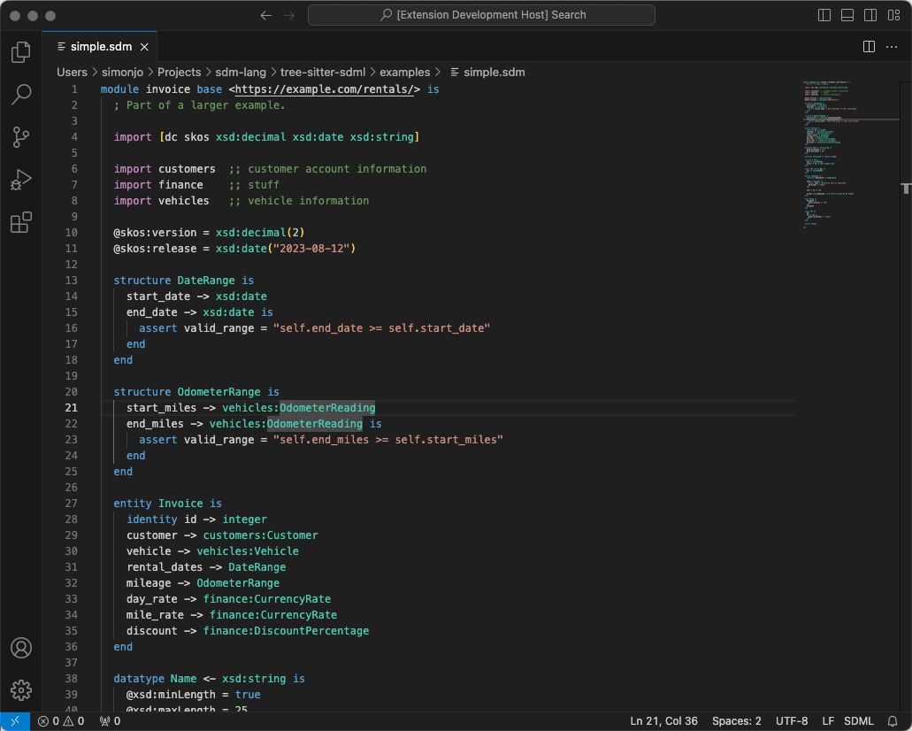
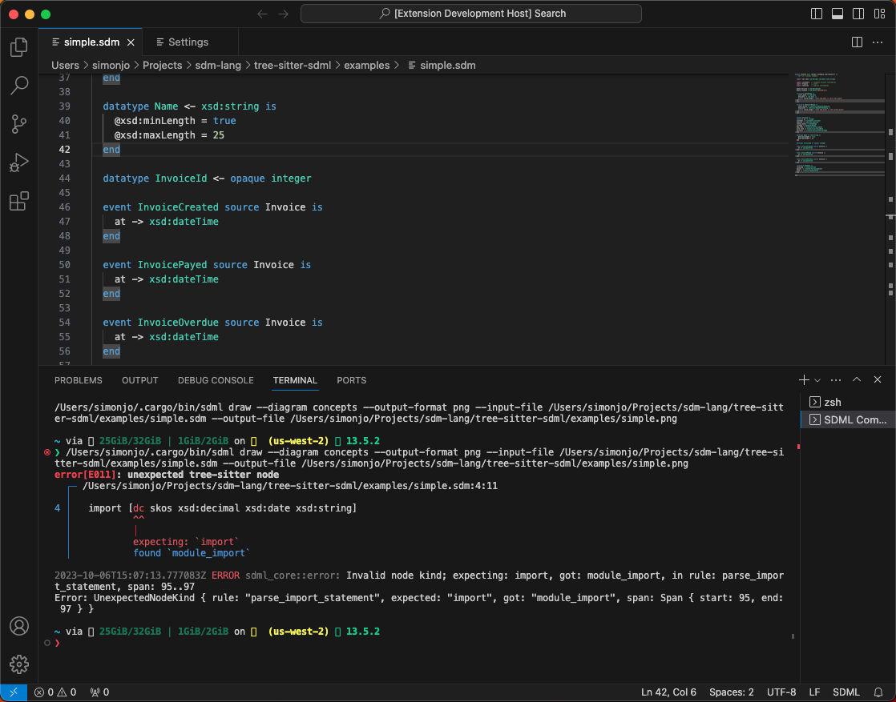
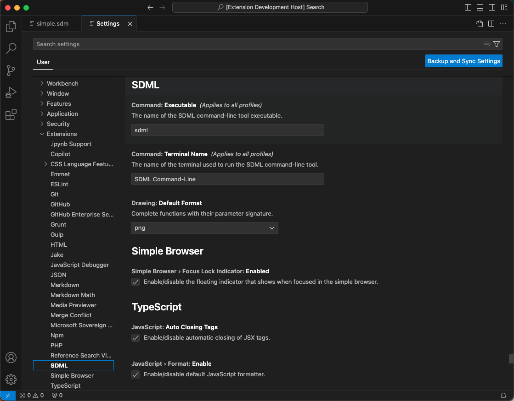

# SDML

This extension, provides syntax support for the [Simple Domain Modeling Language](https://sdml.io) (SDML).

## Features

Syntax highlighting is provided, based upon the existing TextMate grammar in the [SDML.tmbundle](https://github.com/sdm-lang/SDML.tmbundle) repository.



Some of the TextMate bundle's snippets have been copied over as well.

The SDML command-line tool is integrated via the Terminal window. The available commands are:

* Draw Concept Diagram
* Draw Entity-Relationship Diagram
* Draw UML Class Diagram

## Known Issues

Does not yet support formal constraints.

## Manual Installation

Find the extension folder for VSCode on your machine and use Git to clone a copy of this repository locally. Once copied you can restart VSCode to edit SDML files.

* Windows: `%USERPROFILE%\.vscode\extensions``
* macOS: `~/.vscode/extensions``
* Linux: `~/.vscode/extensions``

```bash
$ cd $HOME/.vscode/extensions
$ git clone https://github.com/sdm-lang/sdml-vscode.git
```

## Release Notes

### 0.2.1

* Fix: update README for 0.2.0

### 0.2.0

* Feature: add commands for drawing diagrams, accessible from the palette.
  * Commands only available when editing an SDML file.
  * Execute commands in a terminal window, this allows the user to learn the CLI.



* Feature: add settings for command-line executable name and default drawing format.



### 0.1.0

Initial release.
